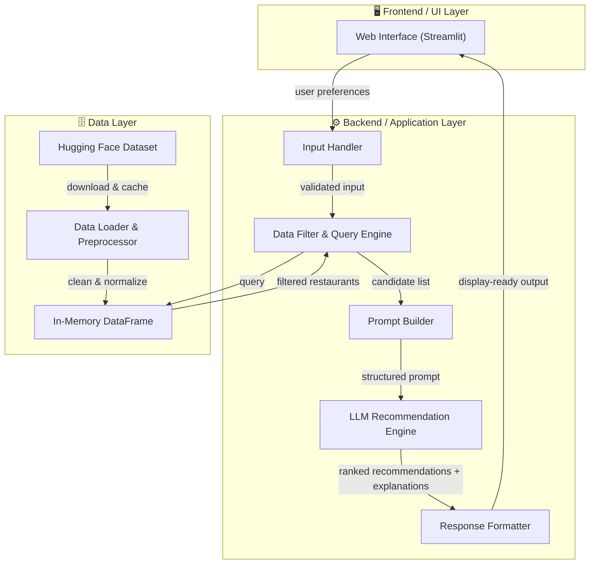
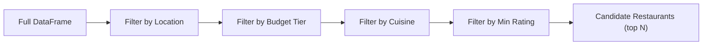
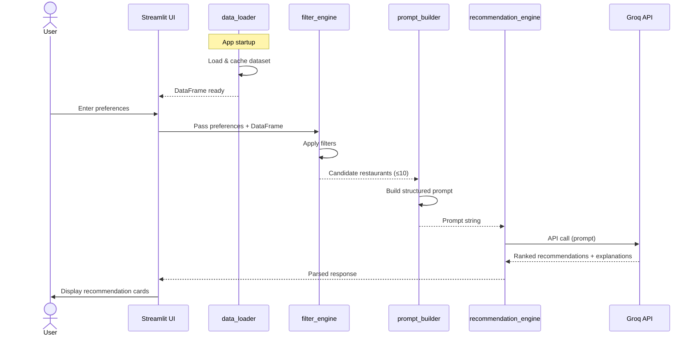
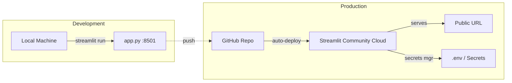

# Architecture: AI-Powered Restaurant Recommendation System

> **Derived from:** [context.md](file:///c:/Zomato_Project_1/Docs/context.md) · [Problem_Statement.txt](file:///c:/Zomato_Project_1/Docs/Problem_Statement.txt)

---

## 1. High-Level System Overview



---

## 2. Technology Stack

| Layer            | Technology                  | Rationale                                              |
| ---------------- | --------------------------- | ------------------------------------------------------ |
| **Language**     | Python 3.10+                | Rich ML/AI ecosystem, rapid prototyping                |
| **UI Framework** | Streamlit                   | Fast interactive UIs with minimal boilerplate           |
| **Data Handling**| Pandas + Hugging Face Hub CSV download | Efficient tabular data ops + direct access to the hosted dataset |
| **LLM Provider** | Groq API (Llama 3)            | Ultra-fast inference, generous free tier, open-source models |
| **Env Config**   | `python-dotenv`             | Secure API key management                              |
| **Deployment**   | Streamlit Community Cloud / Docker | Zero-config hosting for Streamlit apps            |

---

## 3. Module Architecture

### 3.1 Project Directory Structure

```
Zomato_Project_1/
├── Docs/
│   ├── Problem_Statement.txt
│   ├── context.md
│   └── architecture.md          ← you are here
├── src/
│   ├── app.py                   # Streamlit entry point
│   ├── data_loader.py           # Dataset download, caching, preprocessing
│   ├── filter_engine.py         # Query & filter logic
│   ├── prompt_builder.py        # LLM prompt construction
│   ├── recommendation_engine.py # LLM API integration
│   └── utils.py                 # Shared helpers (budget mapping, validators)
├── data/
│   └── zomato_cached.csv        # Locally cached & cleaned dataset
├── .env                         # API keys (git-ignored)
├── .gitignore
├── requirements.txt
└── README.md
```

### 3.2 Module Responsibilities


---

## 4. Detailed Module Design

### 4.1 `data_loader.py` — Data Ingestion

**Responsibility:** Download, cache, clean, and expose the Zomato dataset.

| Aspect              | Detail                                                                 |
| -------------------- | ---------------------------------------------------------------------- |
| **Source**           | `hf_hub_download("ManikaSaini/zomato-restaurant-recommendation", "zomato.csv")` |
| **Caching**          | Save to `data/zomato_cached.csv` after first download                  |
| **Preprocessing**    | Drop nulls, normalize column names, cast types, map cost to budget tiers |
| **Output**           | `pd.DataFrame` with standardized columns                               |

**Key columns after preprocessing:**

```
restaurant_name : str       — Name of the restaurant
location        : str       — City / area
cuisines        : str       — Comma-separated cuisine types
cost_for_two    : float     — Average cost for two people
rating          : float     — Aggregate rating (0.0–5.0)
budget_tier     : str       — Derived: "low" | "medium" | "high"
```

**Budget tier mapping logic:**

```python
def assign_budget_tier(cost: float) -> str:
    if cost <= 500:
        return "low"
    elif cost <= 1500:
        return "medium"
    else:
        return "high"
```

---

### 4.2 `filter_engine.py` — Data Filtering & Query

**Responsibility:** Accept user preferences and return a filtered candidate list from the DataFrame.

**Filter pipeline:**



**Interface:**

```python
def filter_restaurants(
    df: pd.DataFrame,
    location: str | None = None,
    budget: str | None = None,       # "low", "medium", "high"
    cuisine: str | None = None,
    min_rating: float = 0.0,
    top_n: int = 10
) -> pd.DataFrame:
    """Returns up to top_n restaurants matching all provided filters."""
```

**Design decisions:**
- Filters are applied incrementally (chain of `AND` conditions)
- If no restaurants match all filters, progressively relax constraints (drop budget → drop cuisine) and notify the user
- Results are sorted by rating (descending) before truncation

---

### 4.3 `prompt_builder.py` — Prompt Engineering

**Responsibility:** Convert filtered restaurant data + user preferences into a structured LLM prompt.

**Prompt template strategy:**

```
SYSTEM PROMPT:
You are a friendly and knowledgeable restaurant recommendation assistant.
Given a list of restaurants and a user's preferences, rank the top
recommendations and explain why each one is a great fit.

USER PROMPT:
## User Preferences
- Location: {location}
- Budget: {budget}
- Cuisine preference: {cuisine}
- Minimum rating: {min_rating}
- Additional notes: {additional_preferences}

## Available Restaurants
{formatted_restaurant_table}

## Instructions
1. Rank the top 5 restaurants that best match the user's preferences.
2. For each, provide:
   - Restaurant Name
   - Cuisine
   - Rating
   - Estimated Cost for Two
   - A 2-3 sentence explanation of why this restaurant is recommended.
3. Format your response as a numbered list.
```

**Design decisions:**
- Restaurant data is formatted as a markdown table inside the prompt for clarity
- The prompt explicitly instructs the LLM on output format for reliable parsing
- Additional user preferences are passed as free-text to leverage the LLM's reasoning

---

### 4.4 `recommendation_engine.py` — LLM Integration

**Responsibility:** Send the constructed prompt to the LLM API and return parsed recommendations.

**Interface:**

```python
def get_recommendations(prompt: str) -> str:
    """Calls the LLM API and returns the raw recommendation text."""

def parse_recommendations(raw_response: str) -> list[dict]:
    """Parses the LLM output into structured recommendation objects."""
```

**LLM API integration pattern:**

```python
from groq import Groq

client = Groq(api_key=os.getenv("GROQ_API_KEY"))

def get_recommendations(prompt: str, system_prompt: str) -> str:
    chat_completion = client.chat.completions.create(
        messages=[
            {"role": "system", "content": system_prompt},
            {"role": "user", "content": prompt},
        ],
        model="llama-3.3-70b-versatile",
        temperature=0.7,
        max_tokens=2048,
    )
    return chat_completion.choices[0].message.content
```

**Error handling:**
- API rate limits → exponential backoff with max 3 retries
- Empty/malformed response → fallback to displaying raw filtered data
- API key missing → clear error message in UI

---

### 4.5 `app.py` — Streamlit UI

**Responsibility:** End-to-end user interface, orchestrating all modules.

**UI Layout:**

```
┌─────────────────────────────────────────────────┐
│  🍽️ Zomato AI Restaurant Recommender            │
├──────────────────┬──────────────────────────────┤
│   SIDEBAR        │     MAIN CONTENT AREA        │
│                  │                              │
│  📍 Location     │  [Loading / Results]         │
│  💰 Budget       │                              │
│  🍕 Cuisine      │  ┌────────────────────────┐  │
│  ⭐ Min Rating   │  │ 1. Restaurant Card     │  │
│  📝 Additional   │  │    Name / Cuisine      │  │
│                  │  │    Rating / Cost       │  │
│  [🔍 Recommend]  │  │    AI Explanation      │  │
│                  │  └────────────────────────┘  │
│                  │  ┌────────────────────────┐  │
│                  │  │ 2. Restaurant Card     │  │
│                  │  └────────────────────────┘  │
│                  │           ...                │
└──────────────────┴──────────────────────────────┘
```

**Key UI features:**
- Sidebar with form inputs (dropdowns, sliders, text area)
- Loading spinner while LLM processes
- Expandable recommendation cards with AI explanations
- Fallback display of raw data if LLM fails

---

## 5. Data Flow — End to End



---

## 6. API Contract — Recommendation Output Schema

Each recommendation object returned by the engine follows this structure:

```json
{
  "rank": 1,
  "restaurant_name": "Pasta La Vista",
  "cuisine": "Italian",
  "rating": 4.5,
  "cost_for_two": 1200,
  "explanation": "This highly-rated Italian restaurant fits perfectly within your medium budget and is known for its family-friendly atmosphere and authentic pasta dishes."
}
```

---

## 7. Configuration & Environment

### `.env` file

```env
GROQ_API_KEY=your_api_key_here
```

### `requirements.txt`

```
fastapi>=0.110.0
uvicorn[standard]>=0.29.0
pandas>=2.0.0
huggingface_hub>=0.23.0
groq>=0.4.0
python-dotenv>=1.0.0
pydantic>=2.0.0
```

---

## 8. Error Handling Strategy

| Scenario                    | Handling                                                   |
| --------------------------- | ---------------------------------------------------------- |
| Dataset download fails      | Retry with backoff; fall back to cached CSV if available   |
| No restaurants match filters| Relax filters progressively; display "no exact match" message |
| LLM API key missing         | Show setup instructions in the UI                          |
| LLM API rate-limited        | Exponential backoff (3 retries), then show filtered data   |
| LLM returns malformed output| Display raw LLM text + fallback to tabular filtered data   |
| Empty dataset columns       | Skip during preprocessing; log warnings                    |

---

## 9. Future Enhancements

| Enhancement                    | Description                                                |
| ------------------------------ | ---------------------------------------------------------- |
| **Vector Search (RAG)**        | Embed restaurant descriptions with sentence-transformers; use FAISS for semantic search before LLM ranking |
| **User Feedback Loop**         | Let users rate recommendations; fine-tune ranking weights  |
| **Conversation Memory**        | Multi-turn chat for refining preferences                   |
| **Map Integration**            | Show restaurant locations on an interactive map (Folium)   |
| **Review Summarization**       | Summarize user reviews per restaurant using the LLM        |
| **Multi-language Support**     | Serve recommendations in the user's preferred language     |

---

## 10. Deployment Architecture



**Deployment steps:**
1. Push code to GitHub repository
2. Connect repo to Streamlit Community Cloud
3. Add `GROQ_API_KEY` in Streamlit secrets manager
4. App auto-deploys on every push to `main`
