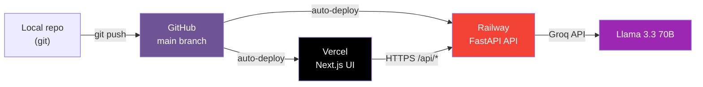

# Deployment Plan: AI-Powered Restaurant Recommendation System

> **Derived from:** [implementation-plan_1.md](file:///c:/Zomato_Project_1/Docs/implementation-plan_1.md) · [architecture_1.md](file:///c:/Zomato_Project_1/Docs/architecture_1.md)

---

## Overview

This document describes how to take the **already-built** Zomato AI Restaurant Recommender from a local working state to a **live production deployment**. It expands on **Phase 6** of the implementation plan into concrete, sequential, copy-pasteable steps.

The application is two independently deployed services:

| Service | Stack | Host | Source |
|---|---|---|---|
| **Back-end API** | FastAPI + Uvicorn (Python 3.10+) | **Railway** | `src/` |
| **Front-end** | Next.js 14 (App Router, TypeScript) | **Vercel** | `frontend/` |

The front-end (Vercel) calls the back-end (Railway) over HTTPS REST. The two are wired together with three environment variables:

- Railway → `GROQ_API_KEY`, `FRONTEND_ORIGIN`
- Vercel → `NEXT_PUBLIC_API_URL`



> **Deployment order matters:** back-end first (to get a public API URL for Vercel), front-end second (to get a public origin for CORS), then a final back-end update to lock CORS to the real Vercel domain.

---

## Pre-Deployment Checklist

Confirm the following before touching any cloud dashboard. These are the assumptions this plan depends on.

| # | Item | Status / How to verify |
|---|------|------------------------|
| 0.1 | App runs locally end-to-end | Back-end on `:8000`, front-end on `:3000`, a recommendation returns successfully |
| 0.2 | `requirements.txt` is present and complete | Already exists at repo root |
| 0.3 | `frontend/vercel.json` is present | Already exists |
| 0.4 | A valid **Groq API key** is available | Get one free at [console.groq.com](https://console.groq.com) |
| 0.5 | `.env` is **git-ignored** (no secrets committed) | `.gitignore` already lists `.env` |
| 0.6 | A GitHub account + empty/target repo | Required by both Railway and Vercel |
| 0.7 | Railway start command config exists | Present: `railpack.json` + `Procfile` |
| 0.8 | Python version pin for Railway | Present: `runtime.txt` |
| 0.9 | Railway variable template exists | Present: `.env.example` |
| 0.10 | Railway Python installer workaround exists | Present: `mise.toml` disables GitHub attestation checks for the pinned Python build |

> ⚠️ **Secret hygiene:** never commit a real `GROQ_API_KEY`. Keep local secrets in ignored `.env`. In production the key is set in the **Railway dashboard**, not in any file.

---

## Phase D0 — Repository Hygiene & Pre-Flight

> **Goal:** Make sure the repo is clean, secret-free, and pushable before any host imports it.

### Tasks

| # | Task | Command / File | Details |
|---|------|----------------|---------|
| D0.1 | Verify no secrets are tracked | `git ls-files .env .env.example frontend/.env.local frontend/.env.example` | Should show `.env.example` and `frontend/.env.example`; must not show `.env` or `frontend/.env.local` |
| D0.2 | Confirm build artifacts are ignored | `.gitignore` | Must ignore `.next/`, `node_modules/`, `data/`, `__pycache__/`, `.env` — already configured |
| D0.3 | Confirm `.env.example` template exists | `.env.example` | Railway can suggest/import variable names from this file; it must contain placeholders only |
| D0.4 | Confirm front-end local env is ignored | `frontend/.env.local` | Local-only file copied from `frontend/.env.example`; must not be committed because Vercel should use dashboard env vars |
| D0.5 | Run a clean local build of both services | see Verification | Catch build errors **before** the cloud does |

### `.env.example` template

```
# Back-end environment variables for Railway/local development.
# Copy to .env locally, or import these names in Railway and fill real values there.
GROQ_API_KEY=your_groq_api_key_here
FRONTEND_ORIGIN=http://localhost:3000
```

### `frontend/.env.example` template

```
# Front-end environment variables.
# Copy to .env.local for local development, and set the real Railway URL in Vercel.
NEXT_PUBLIC_API_URL=http://localhost:8000
```

### Verification

```bash
# Back-end: dependencies import cleanly
python -c "import fastapi, uvicorn, pandas, datasets, groq, dotenv; print('OK')"

# Back-end: API boots and serves health
python -m uvicorn src.main:app --port 8000 &
curl http://localhost:8000/api/health   # -> {"status":"ok","restaurants_loaded":...}

# Front-end: production build succeeds
cd frontend && npm install && npm run build
```

### Deliverables
- [ ] `git status` is clean; no secret files staged
- [ ] `npm run build` in `frontend/` completes with no errors
- [ ] Local `/api/health` returns `ok`

---

## Phase D1 — Confirm Back-End Deploy Configuration

> **Goal:** Confirm the Railway-specific config files required for a successful Railpack deployment exist at the repository root.

### Tasks

| # | Task | File | Details |
|---|------|------|---------|
| D1.1 | Provide Railpack start config | `railpack.json` | Declares the Uvicorn start command Railway/Railpack could not infer automatically |
| D1.2 | Provide a `Procfile` fallback | `Procfile` | Railpack can also detect this Heroku-style web command |
| D1.3 | Pin the Python runtime | `runtime.txt` | Pin to a known-good version (e.g. `python-3.11.9`) to avoid surprise upgrades |
| D1.4 | Confirm start command binds `$PORT` | — | Railway injects `$PORT`; the app **must** bind `0.0.0.0:$PORT` |
| D1.5 | Disable missing Python attestation check | `mise.toml` | Required because Railway's `mise` install can fail for `python@3.11.9` with missing GitHub artifact attestations |

### `railpack.json`

```json
{
  "$schema": "https://schema.railpack.com",
  "deploy": {
    "startCommand": "uvicorn src.main:app --host 0.0.0.0 --port $PORT"
  }
}
```

### `Procfile`

```
web: uvicorn src.main:app --host 0.0.0.0 --port $PORT
```

### `runtime.txt`

```
python-3.11.9
```

### `mise.toml`

```toml
[settings]
python.github_attestations = false
```

### Deliverables
- [ ] `railpack.json`, `Procfile`, `runtime.txt`, `mise.toml`, `.env.example`, and `requirements.txt` exist at the repo root
- [ ] Start command binds `0.0.0.0` and `$PORT` (not a hardcoded `8000`)

### Verification

```bash
# Simulate the production start command locally (use a fixed PORT)
$env:PORT=8080
uvicorn src.main:app --host 0.0.0.0 --port $env:PORT
curl http://localhost:8080/api/health
```

---

## Phase D2 — Push to GitHub

> **Goal:** Get the clean repo onto GitHub, the source of truth both hosts deploy from.

### Tasks

| # | Task | Command | Details |
|---|------|---------|---------|
| D2.1 | Stage and commit deploy config | `git add railpack.json Procfile runtime.txt mise.toml .env.example` | Commit the Phase D1 files |
| D2.2 | Commit any pending app changes | `git commit -m "Add deploy config"` | Keep secrets out of the commit |
| D2.3 | Create the GitHub remote | (GitHub UI or `gh repo create`) | Empty repo, no README to avoid conflicts |
| D2.4 | Push `main` | `git push -u origin main` | Both Railway and Vercel deploy from `main` |

### Verification
```bash
git remote -v                 # origin points at the GitHub repo
git log --oneline -5          # latest commit includes deploy config
# On GitHub: confirm .env is NOT present in the file list
```

### Deliverables
- [ ] Repo is on GitHub, `main` branch pushed
- [ ] No `.env` / secret files visible in the GitHub repo

---

## Phase D3 — Deploy Back-End to Railway

> **Goal:** Stand up the FastAPI service and obtain a public API URL.

### Tasks

| # | Task | Where | Details |
|---|------|-------|---------|
| D3.1 | Create a Railway project from the GitHub repo | Railway dashboard | **Root = repository root** (the folder containing `src/`) |
| D3.2 | Confirm builder detects Python | Railway → Settings | Railpack should auto-detect `requirements.txt` + `runtime.txt` |
| D3.3 | Confirm the start command source | Railway deploy logs/settings | Railpack should read `railpack.json`; fallback is `Procfile` |
| D3.4 | Add/import `GROQ_API_KEY` variable | Railway → Variables | Use suggestions from `.env.example`, then replace placeholder with your real Groq key — **set here, never in a file** |
| D3.5 | Add/import `FRONTEND_ORIGIN` variable | Railway → Variables | Use suggestions from `.env.example`; temporarily `http://localhost:3000`, then update in Phase D5 |
| D3.6 | Set the health check path | Railway → Settings | `/api/health` with a generous timeout (dataset loads at startup) |
| D3.7 | Deploy and capture the public URL | Railway → Settings → Networking | Generate a public domain, e.g. `https://<app>.up.railway.app` |

> ⏱️ **First-boot latency:** `load_data()` downloads the Hugging Face dataset on first run, then caches to `data/zomato_cached.csv`. Railway's filesystem is ephemeral, so the **download happens on every cold start**. Set a health-check timeout of ~300s so the first deploy isn't killed mid-download.

### Verification

```bash
# Replace with your real Railway domain
curl https://<app>.up.railway.app/api/health
# -> {"status":"ok","restaurants_loaded":<n>}

curl https://<app>.up.railway.app/api/options
# -> {"locations":[...],"cuisines":[...]}
```

### Deliverables
- [ ] Back-end is live on Railway with a public HTTPS URL
- [ ] `/api/health` returns `ok` with a non-zero `restaurants_loaded`
- [ ] `GROQ_API_KEY` is configured in Railway variables

---

## Phase D4 — Deploy Front-End to Vercel

> **Goal:** Stand up the Next.js UI, pointed at the live Railway API.

### Tasks

| # | Task | Where | Details |
|---|------|-------|---------|
| D4.1 | Import the same GitHub repo into Vercel | Vercel dashboard → New Project | Same repository as Railway |
| D4.2 | Set **Root Directory** = `frontend/` | Vercel → Project Settings | Critical — the Next.js app is not at repo root |
| D4.3 | Confirm framework preset = Next.js | Vercel → Build Settings | `vercel.json` already pins build/install commands |
| D4.4 | Add `NEXT_PUBLIC_API_URL` env var before build | Vercel → Environment Variables | Set to the Railway URL from D3.7 (no trailing slash); do not rely on `frontend/.env.local` |
| D4.5 | Apply env var to all environments | Vercel → Env scope | Production (and Preview if used) |
| D4.6 | Deploy and capture the Vercel URL | Vercel → Deployments | e.g. `https://<app>.vercel.app` |

> ⚠️ `NEXT_PUBLIC_*` variables are **baked in at build time**. If `NEXT_PUBLIC_API_URL` is missing or changed later, you must **redeploy** for the browser bundle to use the Railway URL.

### Verification
- [ ] Vercel build succeeds (check build logs)
- [ ] Page loads at the Vercel URL
- [ ] Location/cuisine dropdowns populate (proves the live `/api/options` call works)

---

## Phase D5 — Wire CORS & Cross-Origin (Final Link)

> **Goal:** Lock the back-end's CORS to the real Vercel domain so the deployed front-end can call the API.

### Tasks

| # | Task | Where | Details |
|---|------|-------|---------|
| D5.1 | Update `FRONTEND_ORIGIN` on Railway | Railway → Variables | Set to the exact Vercel domain from D4.6 (scheme + host, no trailing slash) |
| D5.2 | Redeploy the back-end | Railway | Picks up the new `FRONTEND_ORIGIN` for `CORSMiddleware` |
| D5.3 | Verify no browser CORS errors | Browser devtools → Network | Submit a recommendation from the live UI |
| D5.4 | (Optional) Allow Vercel preview origins | `src/main.py` | If using preview deploys, add a regex/allow-list for `*.vercel.app` |

> **Note on the current CORS config:** `src/main.py` builds `allow_origins=[FRONTEND_ORIGIN, "http://localhost:3000"]`. Setting `FRONTEND_ORIGIN` to the Vercel domain is sufficient. The hardcoded localhost entry is harmless in production but can be removed for a stricter posture.

### Verification

```bash
# Preflight check from the Vercel origin
curl -X OPTIONS https://<app>.up.railway.app/api/recommend \
  -H "Origin: https://<app>.vercel.app" \
  -H "Access-Control-Request-Method: POST" -i
# -> 200/204 with Access-Control-Allow-Origin matching the Vercel domain
```

### Deliverables
- [ ] `FRONTEND_ORIGIN` on Railway equals the live Vercel domain
- [ ] Live UI submits a recommendation with no CORS error in the console

---

## Phase D6 — End-to-End Production Smoke Test

> **Goal:** Prove the full deployed user flow works over HTTPS.

### Automated checks

```bash
# 1. Back-end health
curl https://<app>.up.railway.app/api/health

# 2. Dropdown data
curl https://<app>.up.railway.app/api/options

# 3. Full recommendation pipeline (exercises Groq)
curl -X POST https://<app>.up.railway.app/api/recommend \
  -H "Content-Type: application/json" \
  -d '{"location":"Koramangala 5th Block","budget":"medium","cuisine":"North Indian","min_rating":3.5,"top_n":10}'
# -> {"status":"ok","recommendations":[...]}
```

### Manual UI checklist (on the live Vercel URL)

- [ ] Page loads with no console errors
- [ ] Location & cuisine dropdowns are populated from the live API
- [ ] Selecting preferences + "Recommend" returns AI recommendation cards
- [ ] Loading state shows while the request is in flight
- [ ] "No results" message shows for an impossible filter combination
- [ ] If `GROQ_API_KEY` were missing, the UI shows the setup/`missing_key` message

### Error-path verification (from Implementation Plan §6 matrix)

| Scenario | Expected production behavior |
|----------|------------------------------|
| Filters match nothing | `no_results` status → friendly "relax criteria" UI |
| Groq rate-limited | Backoff (3 retries) → `llm_error` with fallback candidate table |
| Groq returns malformed output | `llm_error` → fallback table rendered |
| `GROQ_API_KEY` missing/invalid | `missing_key` status → setup instructions in UI |

---

## Phase D7 — Post-Deployment Operations

> **Goal:** Keep the deployed app healthy and easy to maintain.

### Tasks

| # | Task | Details |
|---|------|---------|
| D7.1 | Confirm auto-deploy on push | Both hosts redeploy on every push to `main` |
| D7.2 | Watch logs after first deploy | Railway logs for dataset load + Groq calls; Vercel logs for build |
| D7.3 | Document the live URLs | Add the Railway + Vercel URLs to `README.md` |
| D7.4 | Rotate the Groq key if it was ever exposed | The key currently sits in local `.env`; rotate at console.groq.com if leaked |
| D7.5 | (Optional) Persist the dataset cache | Attach a Railway volume at `data/` to skip re-download on cold start |
| D7.6 | (Optional) Add a custom domain | Map a domain in Vercel; update `FRONTEND_ORIGIN` accordingly |

### Deliverables
- [ ] Both services auto-deploy from `main`
- [ ] Live URLs recorded in the README
- [ ] No secrets committed; key rotated if necessary

---

## Environment Variable Reference

| Variable | Service | Local value | Production value | Notes |
|---|---|---|---|---|
| `GROQ_API_KEY` | Back-end (Railway) | in `.env` | Railway dashboard var | Server-side secret — never exposed to the browser |
| `FRONTEND_ORIGIN` | Back-end (Railway) | `http://localhost:3000` | the Vercel domain | Drives CORS allow-list |
| `NEXT_PUBLIC_API_URL` | Front-end (Vercel) | `http://localhost:8000` | the Railway URL | Public, baked in at build → redeploy on change |

---

## Deployment Sequence Summary

| Phase | Name | Key Output | Blocks |
|-------|------|------------|--------|
| **D0** | Repo Hygiene & Pre-Flight | Clean, secret-free, buildable repo | everything |
| **D1** | Back-End Deploy Config | `railpack.json`, `Procfile`, `runtime.txt`, `mise.toml` | D3 |
| **D2** | Push to GitHub | `main` branch on GitHub | D3, D4 |
| **D3** | Deploy Back-End (Railway) | Public API URL | D4 |
| **D4** | Deploy Front-End (Vercel) | Public UI URL | D5 |
| **D5** | Wire CORS / Cross-Origin | UI ↔ API connected | D6 |
| **D6** | E2E Smoke Test | Verified production flow | D7 |
| **D7** | Post-Deploy Ops | Monitoring, docs, hardening | — |

---

## Rollback & Troubleshooting

| Symptom | Likely cause | Fix |
|---------|--------------|-----|
| `No start command detected` | Railway/Railpack could not infer how to run FastAPI | Confirm `railpack.json` exists at repo root and contains `deploy.startCommand`; redeploy from latest GitHub commit |
| `No GitHub artifact attestations found for python@3.11.9` | `mise` attestation verification fails for the pinned Python artifact | Confirm `mise.toml` exists with `python.github_attestations = false`; redeploy |
| Railway Variables tab does not suggest app vars | No root env template detected, or Railway has not pulled the latest commit | Confirm `.env.example` exists at repo root, redeploy/import variables manually if needed |
| Railway deploy times out on first boot | Dataset download exceeds health-check timeout | Raise `healthcheckTimeout` (~300s); optionally attach a volume at `data/` |
| Front-end says it could not load options from API | Vercel build has no `NEXT_PUBLIC_API_URL`, or it was built with a stale localhost value | Delete any tracked `frontend/.env.local`, set `NEXT_PUBLIC_API_URL` in Vercel to the Railway URL, then redeploy the front-end |
| Browser shows CORS error | `FRONTEND_ORIGIN` ≠ live Vercel domain (or trailing slash) | Fix the Railway var to the exact origin, redeploy |
| UI loads but dropdowns empty / network error | `NEXT_PUBLIC_API_URL` wrong or not redeployed | Set correct Railway URL in Vercel, **redeploy** |
| `missing_key` on every request | `GROQ_API_KEY` not set on Railway | Add the variable, redeploy |
| `llm_error` with fallback table | Groq rate limit or transient API error | Expected degradation; retry; check Groq quota |
| Need to revert a bad deploy | Latest commit broke prod | Railway: redeploy a previous build; Vercel: promote a prior deployment |

> **Rollback principle:** both hosts keep prior builds. Reverting is a dashboard action (redeploy/promote a previous build) or `git revert` + push — no destructive history rewrites required.
