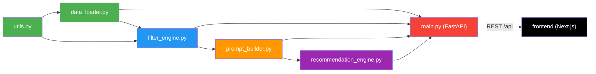

# Implementation Plan: AI-Powered Restaurant Recommendation System

> **Derived from:** [context_1.md](file:///c:/Zomato_Project_1/Docs/context_1.md) · [architecture_1.md](file:///c:/Zomato_Project_1/Docs/architecture_1.md)

---

## Overview

This document breaks down the full build of the Zomato AI Restaurant Recommender into **6 sequential phases**. Each phase has clearly defined goals, file-level tasks, dependencies, and verification criteria. Phases are ordered so that each one builds on the last — no phase starts until its prerequisites are met.

> **Architecture:** The app is split into two independently deployed services — a **FastAPI back-end** (Python pipeline in `src/`, deployed on **Railway**) and a **Next.js front-end** (`frontend/`, deployed on **Vercel**). The front-end talks to the back-end over a REST API.

```mermaid
gantt
    title Implementation Phases
    dateFormat  X
    axisFormat %s

    section Foundation
    Phase 1 – Project Setup           :p1, 0, 1
    Phase 2 – Data Ingestion          :p2, after p1, 2

    section Core Logic
    Phase 3 – Filter Engine           :p3, after p2, 2
    Phase 4 – Prompt & LLM Engine     :p4, after p3, 3

    section UI & Polish
    Phase 5A – Back-End API (Railway) :p5a, after p4, 2
    Phase 5B – Front-End (Vercel)     :p5b, after p5a, 2
    Phase 6 – Testing & Deployment    :p6, after p5b, 2
```



---

## Phase 1 — Project Setup & Environment

> **Goal:** Establish the project skeleton, install dependencies, and configure environment variables so all subsequent phases have a working foundation.

### Tasks

| # | Task | File(s) | Details |
|---|------|---------|---------|
| 1.1 | Create back-end directory structure | `src/`, `data/`, `Docs/` | Python pipeline + FastAPI API; match the layout in [architecture_1.md §3.1](file:///c:/Zomato_Project_1/Docs/architecture_1.md) |
| 1.2 | Initialize back-end `requirements.txt` | `requirements.txt` | `fastapi>=0.110.0`, `uvicorn[standard]>=0.29.0`, `pandas>=2.0.0`, `datasets>=2.14.0`, `groq>=0.4.0`, `python-dotenv>=1.0.0`, `pydantic>=2.0.0` |
| 1.3 | Scaffold front-end app | `frontend/` | Create a Next.js (App Router, TypeScript) app: `npx create-next-app@latest frontend` |
| 1.4 | Create back-end `.env` template | `.env` | `GROQ_API_KEY=your_api_key_here`, `FRONTEND_ORIGIN=http://localhost:3000` |
| 1.5 | Create front-end `.env` template | `frontend/.env.example` | `NEXT_PUBLIC_API_URL=http://localhost:8000`; copy to ignored `.env.local` for local development |
| 1.6 | Configure `.gitignore` | `.gitignore` | Ignore `.env`, `*.env.local`, `data/`, `__pycache__/`, `*.pyc`, `frontend/node_modules/`, `frontend/.next/` |
| 1.7 | Create placeholder back-end modules | `src/main.py`, `src/data_loader.py`, `src/filter_engine.py`, `src/prompt_builder.py`, `src/recommendation_engine.py`, `src/utils.py` | Empty files with module docstrings (`src/main.py` = FastAPI entry) |
| 1.8 | Install dependencies | — | Back-end: `pip install -r requirements.txt`; front-end: `cd frontend && npm install` |
| 1.9 | Create `README.md` | `README.md` | Project title, description, back-end + front-end setup, usage |

### Deliverables
- [ ] All directories and placeholder files exist (`src/` back-end, `frontend/` front-end)
- [ ] `pip install -r requirements.txt` completes without errors
- [ ] `cd frontend && npm install` completes without errors
- [ ] `.env` and `frontend/.env.local` are local-only and git-ignored; `.env.example` templates are committed

### Verification
```bash
# Back-end imports should succeed with no errors
python -c "import fastapi; import uvicorn; import pandas; import datasets; import groq; import dotenv; print('✅ Back-end dependencies installed')"

# Front-end toolchain is ready
cd frontend && npm run build --dry-run 2>/dev/null || echo "✅ Next.js app scaffolded"
```

---

## Phase 2 — Data Ingestion & Preprocessing

> **Goal:** Download the Zomato dataset from Hugging Face, clean it, cache it locally, and expose a standardized DataFrame for downstream modules.

### Dependencies
- ✅ Phase 1 complete (dependencies installed)

### Tasks

| # | Task | File(s) | Details |
|---|------|---------|---------|
| 2.1 | Implement dataset download | `src/data_loader.py` | Use `datasets.load_dataset("ManikaSaini/zomato-restaurant-recommendation")` |
| 2.2 | Implement local caching | `src/data_loader.py` | Save to `data/zomato_cached.csv` after first download; load from cache on subsequent runs |
| 2.3 | Implement preprocessing pipeline | `src/data_loader.py` | Drop nulls, normalize column names to lowercase/snake_case, cast types (`cost_for_two` → float, `rating` → float) |
| 2.4 | Implement budget tier mapping | `src/utils.py` | `assign_budget_tier(cost)`: ≤500 → "low", ≤1500 → "medium", >1500 → "high" |
| 2.5 | Add `budget_tier` column | `src/data_loader.py` | Apply `assign_budget_tier()` to create derived column |
| 2.6 | Expose `load_data()` function | `src/data_loader.py` | Returns cleaned `pd.DataFrame` with standardized columns |

### Target Schema

```
restaurant_name : str       — Name of the restaurant
location        : str       — City / area
cuisines        : str       — Comma-separated cuisine types
cost_for_two    : float     — Average cost for two people
rating          : float     — Aggregate rating (0.0–5.0)
budget_tier     : str       — Derived: "low" | "medium" | "high"
```

### Deliverables
- [x] `load_data()` returns a clean DataFrame with all 6 columns
- [x] `data/zomato_cached.csv` is created on first run
- [x] Subsequent calls load from cache (faster startup)

### Verification
```python
from src.data_loader import load_data

df = load_data()
assert not df.empty, "DataFrame should not be empty"
assert set(["restaurant_name", "location", "cuisines", "cost_for_two", "rating", "budget_tier"]).issubset(df.columns)
assert df["budget_tier"].isin(["low", "medium", "high"]).all()
print(f"✅ Loaded {len(df)} restaurants")
print(df.head())
```

---

## Phase 3 — Filter Engine

> **Goal:** Build the query/filter layer that takes user preferences and returns a ranked candidate list from the DataFrame.

### Dependencies
- ✅ Phase 2 complete (`load_data()` returns a valid DataFrame)

### Tasks

| # | Task | File(s) | Details |
|---|------|---------|---------|
| 3.1 | Implement `filter_restaurants()` | `src/filter_engine.py` | Accept `df`, `location`, `budget`, `cuisine`, `min_rating`, `top_n` parameters |
| 3.2 | Implement incremental filter chain | `src/filter_engine.py` | Apply filters as chained `AND` conditions: location → budget → cuisine → min_rating |
| 3.3 | Implement filter relaxation fallback | `src/filter_engine.py` | If 0 results, progressively relax: drop budget → drop cuisine; return partial matches with a flag |
| 3.4 | Sort results by rating | `src/filter_engine.py` | Descending sort, truncate to `top_n` (default 10) |
| 3.5 | Add helper: extract unique locations | `src/utils.py` | `get_unique_locations(df)` → sorted list for UI dropdowns |
| 3.6 | Add helper: extract unique cuisines | `src/utils.py` | `get_unique_cuisines(df)` → sorted list (split comma-separated values) |

### Interface

```python
def filter_restaurants(
    df: pd.DataFrame,
    location: str | None = None,
    budget: str | None = None,       # "low", "medium", "high"
    cuisine: str | None = None,
    min_rating: float = 0.0,
    top_n: int = 10
) -> pd.DataFrame:
    """Returns up to top_n restaurants matching all provided filters."""
```

### Deliverables
- [x] `filter_restaurants()` returns correct subsets for various filter combinations
- [x] Relaxation fallback works when no exact matches exist
- [x] Helper functions return clean, sorted lists

### Verification
```python
from src.data_loader import load_data
from src.filter_engine import filter_restaurants

df = load_data()
results = filter_restaurants(df, location="Koramangala 5th Block", budget="medium", min_rating=3.5, top_n=5)
assert len(results) <= 5
assert (results["rating"] >= 3.5).all()
print(f"✅ Returned {len(results)} restaurants")
print(results[["restaurant_name", "rating", "budget_tier"]])
```

---

## Phase 4 — Prompt Engineering & LLM Integration

> **Goal:** Build the prompt construction layer and integrate with the Groq API to get ranked, explained recommendations from Llama 3.

### Dependencies
- ✅ Phase 3 complete (filtered candidate list available)
- ✅ Valid `GROQ_API_KEY` in `.env`

### Tasks

| # | Task | File(s) | Details |
|---|------|---------|---------|
| 4.1 | Define system prompt | `src/prompt_builder.py` | Friendly restaurant assistant persona with clear output format instructions |
| 4.2 | Implement `build_prompt()` | `src/prompt_builder.py` | Convert user preferences + filtered DataFrame → structured user prompt with markdown table |
| 4.3 | Implement restaurant table formatter | `src/prompt_builder.py` | Format candidate restaurants as a readable markdown table inside the prompt |
| 4.4 | Implement `get_recommendations()` | `src/recommendation_engine.py` | Call Groq API with `llama-3.3-70b-versatile`, `temperature=0.7`, `max_tokens=2048` |
| 4.5 | Implement error handling | `src/recommendation_engine.py` | API key validation, rate-limit retry (exponential backoff, max 3), empty response fallback |
| 4.6 | Implement `parse_recommendations()` | `src/recommendation_engine.py` | Parse LLM text output into `list[dict]` with keys: `rank`, `restaurant_name`, `cuisine`, `rating`, `cost_for_two`, `explanation` |
| 4.7 | Load environment variables | `src/recommendation_engine.py` | Use `python-dotenv` to load `GROQ_API_KEY` |

### Prompt Template

```
SYSTEM: You are a friendly and knowledgeable restaurant recommendation assistant.
        Given a list of restaurants and a user's preferences, rank the top
        recommendations and explain why each one is a great fit.

USER:   ## User Preferences
        - Location: {location}
        - Budget: {budget}
        - Cuisine preference: {cuisine}
        - Minimum rating: {min_rating}
        - Additional notes: {additional_preferences}

        ## Available Restaurants
        {formatted_restaurant_table}

        ## Instructions
        1. Rank the top 5 restaurants that best match.
        2. For each, provide: Name, Cuisine, Rating, Cost for Two, Explanation.
        3. Format as a numbered list.
```

### LLM API Integration

```python
from groq import Groq

client = Groq(api_key=os.getenv("GROQ_API_KEY"))

def get_recommendations(prompt: str, system_prompt: str) -> str:
    chat_completion = client.chat.completions.create(
        messages=[
            {"role": "system", "content": system_prompt},
            {"role": "user", "content": prompt},
        ],
        model="llama-3.3-70b-versatile",
        temperature=0.7,
        max_tokens=2048,
    )
    return chat_completion.choices[0].message.content
```

### Deliverables
- [x] `build_prompt()` produces a well-structured prompt string
- [x] `get_recommendations()` successfully calls Groq API and returns text
- [x] `parse_recommendations()` extracts structured data from LLM output
- [x] Error handling covers missing key, rate limits, and malformed responses

### Verification
```python
from src.data_loader import load_data
from src.filter_engine import filter_restaurants
from src.prompt_builder import build_prompt, SYSTEM_PROMPT
from src.recommendation_engine import get_recommendations

df = load_data()
filtered = filter_restaurants(df, location="Koramangala 5th Block", budget="medium", top_n=10)
prompt = build_prompt(filtered, location="Koramangala 5th Block", budget="medium", cuisine="North Indian", min_rating=3.5)
response = get_recommendations(prompt, SYSTEM_PROMPT)
assert len(response) > 0
print("✅ LLM returned recommendations")
print(response[:500])
```

---

## Phase 5 — Web Application (API + UI)

> **Goal:** Expose the recommendation pipeline through a polished, user-facing web app. This phase is split into a **back-end** sub-phase (FastAPI REST API, deployed on **Railway**) and a **front-end** sub-phase (Next.js app, deployed on **Vercel**) that consumes the API.

### Dependencies
- ✅ Phase 4 complete (full recommendation pipeline functional)

---

### Phase 5A — Back-End API (FastAPI on Railway)

> **Goal:** Wrap the data, filter, prompt, and LLM modules behind a clean REST API so any client can request recommendations without knowing pipeline internals.

#### Dependencies
- ✅ Phase 4 complete (full recommendation pipeline functional)

#### Tasks

| # | Task | File(s) | Details |
|---|------|---------|---------|
| 5A.1 | Initialize FastAPI app + CORS | `src/main.py` | Create `FastAPI()` instance; add `CORSMiddleware` allowing `FRONTEND_ORIGIN` (Vercel domain + localhost) |
| 5A.2 | Load data once at startup | `src/main.py` | Call `load_data()` in a startup event / module-level cache; reuse the in-memory DataFrame across requests |
| 5A.3 | Define Pydantic request/response models | `src/main.py` | `RecommendRequest` (location, budget, cuisine, min_rating, additional_preferences, top_n) and `RecommendResponse` (status, recommendations, fallback) |
| 5A.4 | `GET /api/options` endpoint | `src/main.py` | Return `{ locations, cuisines }` via `get_unique_locations()` / `get_unique_cuisines()` to populate front-end dropdowns |
| 5A.5 | `POST /api/recommend` endpoint | `src/main.py` | Orchestrate filter → build prompt → call LLM → parse → return structured `recommendations` list |
| 5A.6 | Status + error handling | `src/main.py` | Return a typed `status`: `ok` \| `no_results` \| `missing_key` \| `llm_error`; map to proper HTTP codes |
| 5A.7 | Fallback payload | `src/main.py` | On `llm_error`/`no_results`, include the filtered candidate rows so the front-end can still render a table |
| 5A.8 | `GET /api/health` endpoint | `src/main.py` | Lightweight health check for Railway readiness probes |

#### API Contract

```
GET  /api/health    → { "status": "ok" }
GET  /api/options   → { "locations": [...], "cuisines": [...] }
POST /api/recommend
     body: {
       "location": "Koramangala 5th Block", "budget": "medium", "cuisine": "North Indian",
       "min_rating": 3.5, "additional_preferences": "outdoor seating", "top_n": 10
     }
     200: {
       "status": "ok",
       "recommendations": [
         { "rank": 1, "restaurant_name": "...", "cuisine": "...",
           "rating": 4.5, "cost_for_two": 1200, "explanation": "..." }
       ],
       "fallback": null
     }
```

#### Deliverables
- [x] FastAPI app runs locally with `uvicorn src.main:app --reload`
- [x] CORS allows the front-end origin
- [x] `/api/options` and `/api/recommend` return correct, typed JSON
- [x] Missing API key, LLM failure, and "no results" map to explicit `status` values + fallback data

#### Verification
```bash
# Run the API
uvicorn src.main:app --reload --port 8000

# In another shell:
curl http://localhost:8000/api/health
curl http://localhost:8000/api/options
curl -X POST http://localhost:8000/api/recommend \
  -H "Content-Type: application/json" \
  -d '{"location":"Koramangala 5th Block","budget":"medium","cuisine":"North Indian","min_rating":3.5,"top_n":10}'
# ✅ Expect JSON with a "status" field and a "recommendations" array
```

---

### Phase 5B — Front-End (Next.js on Vercel)

> **Goal:** Build the visual layer — page layout, preference form, and result rendering — calling only the Phase 5A REST API.

#### Dependencies
- ✅ Phase 5A complete (API endpoints available)
- ✅ `NEXT_PUBLIC_API_URL` points at the back-end (local or Railway)

#### Tasks

| # | Task | File(s) | Details |
|---|------|---------|---------|
| 5B.1 | Set up app shell & layout | `frontend/app/layout.tsx`, `frontend/app/page.tsx` | Title "🍽️ Zomato AI Restaurant Recommender", responsive two-column layout |
| 5B.2 | Create typed API client | `frontend/lib/api.ts` | `getOptions()` and `getRecommendations(prefs)` using `NEXT_PUBLIC_API_URL`; share TS types with the API contract |
| 5B.3 | Build preference form | `frontend/components/PreferenceForm.tsx` | Location select, budget radio, cuisine select, rating slider (0.0–5.0), additional-preferences textarea |
| 5B.4 | Populate dropdowns dynamically | `frontend/components/PreferenceForm.tsx` | Fetch `/api/options` on load to fill location/cuisine selects |
| 5B.5 | Implement "Recommend" action | `frontend/app/page.tsx` | On submit: `POST /api/recommend`, route response `status` to the right view |
| 5B.6 | Add loading state | `frontend/components/Results.tsx` | Spinner / skeleton ("Finding your perfect restaurants...") while the request is in flight |
| 5B.7 | Build recommendation cards | `frontend/components/RestaurantCard.tsx` | Card per result: name, cuisine, rating, cost, and AI explanation |
| 5B.8 | Error/fallback UI | `frontend/components/Results.tsx` | On `llm_error`, render the fallback candidate table; on `missing_key`, show setup instructions |
| 5B.9 | "No results" handling | `frontend/components/Results.tsx` | On `no_results`, show a friendly message suggesting the user relax criteria |

#### UI Layout

```
┌─────────────────────────────────────────────────┐
│  🍽️ Zomato AI Restaurant Recommender            │
├──────────────────┬──────────────────────────────┤
│   FORM PANEL     │     MAIN CONTENT AREA        │
│                  │                              │
│  📍 Location     │  [Loading / Results]         │
│  💰 Budget       │                              │
│  🍕 Cuisine      │  ┌────────────────────────┐  │
│  ⭐ Min Rating   │  │ 1. Restaurant Card     │  │
│  📝 Additional   │  │    Name / Cuisine      │  │
│                  │  │    Rating / Cost       │  │
│  [🔍 Recommend]  │  │    AI Explanation      │  │
│                  │  └────────────────────────┘  │
└──────────────────┴──────────────────────────────┘
```

#### Deliverables
- [ ] App runs locally with `cd frontend && npm run dev`
- [ ] Form inputs are functional and dropdowns are populated from `/api/options`
- [ ] Recommendation cards display correctly with AI explanations
- [ ] Loading state shows while the API request is in flight
- [ ] Error states (no results, API failure, missing key) handled gracefully

#### Verification
```bash
# With the back-end running on :8000
cd frontend && npm run dev   # serves on http://localhost:3000

# Manual test checklist:
# ☐ Page loads without errors
# ☐ Dropdowns are populated from the live /api/options call
# ☐ Selecting preferences and clicking "Recommend" returns results
# ☐ Results display in formatted cards with explanations
# ☐ Back-end without API key shows appropriate setup message
# ☐ Extreme filter combinations show "no results" message
```

---

## Phase 6 — Testing, Polish & Deployment

> **Goal:** Harden the application with error handling, add final polish, and deploy to production.

### Dependencies
- ✅ Phase 5 complete (back-end API + front-end both functional locally)

### Tasks

| # | Task | File(s) | Details |
|---|------|---------|---------|
| 6.1 | End-to-end error handling audit | All `src/`, `frontend/` files | Verify all error scenarios from [architecture_1.md §8](file:///c:/Zomato_Project_1/Docs/architecture_1.md) are covered |
| 6.2 | Add logging | All `src/` files | Use Python `logging` module for key events (data load, filter results, API calls, errors) |
| 6.3 | Performance optimization | `src/main.py`, `src/data_loader.py` | Load data once at startup; verify the in-memory DataFrame is reused across requests |
| 6.4 | Code cleanup & docstrings/types | `src/`, `frontend/` | Python docstrings + type hints; TypeScript types and clean formatting on the front-end |
| 6.5 | Update `README.md` | `README.md` | Full setup guide, screenshots, usage, and Railway + Vercel deployment steps |
| 6.6 | Add deploy config | `Procfile`/`railway.json`, `frontend/vercel.json` | Back-end start command for Railway (`uvicorn src.main:app --host 0.0.0.0 --port $PORT`); front-end build settings for Vercel |
| 6.7 | Deploy back-end to Railway | — | Connect GitHub repo, set `GROQ_API_KEY` + `FRONTEND_ORIGIN`, deploy the FastAPI service |
| 6.8 | Deploy front-end to Vercel | — | Import repo (root `frontend/`), set `NEXT_PUBLIC_API_URL` to the Railway URL, deploy |
| 6.9 | Wire CORS + cross-origin | `src/main.py` | Set Railway `FRONTEND_ORIGIN` to the Vercel domain; confirm the deployed front-end can call the API |

### Error Handling Matrix (from Architecture §8)

| Scenario | Expected Behavior |
|----------|-------------------|
| Dataset download fails | Retry with backoff; fall back to cached CSV |
| No restaurants match filters | Relax filters progressively; show "no exact match" message |
| LLM API key missing | Show setup instructions in the UI |
| LLM API rate-limited | Exponential backoff (3 retries), then show filtered data |
| LLM returns malformed output | Display raw LLM text + fallback to tabular data |
| Empty dataset columns | Skip during preprocessing; log warnings |

### Deployment Steps

**Back-end → [Railway](https://railway.app)**
1. Push code to the GitHub repository
2. Create a Railway project from the repo (root = repository root containing `src/`)
3. Set the start command: `uvicorn src.main:app --host 0.0.0.0 --port $PORT`
4. Add environment variables: `GROQ_API_KEY` and `FRONTEND_ORIGIN` (the Vercel URL)
5. Deploy; note the public Railway API URL

**Front-end → [Vercel](https://vercel.com)**
1. Import the same repo into Vercel, set the **Root Directory** to `frontend/`
2. Add environment variable `NEXT_PUBLIC_API_URL` = the Railway API URL
3. Deploy; both services auto-deploy on every push to `main`
4. Update Railway's `FRONTEND_ORIGIN` to the final Vercel domain and redeploy

### Deliverables
- [ ] All error scenarios handled and tested
- [ ] Logging captures key events
- [ ] README is complete with setup and usage instructions
- [ ] Back-end is live on Railway and front-end is live on Vercel, communicating over HTTPS

### Verification
```bash
# Final smoke test (deployed)
curl https://<your-app>.up.railway.app/api/health

# Deployment verification:
# ☐ Back-end API is live on Railway (/api/health returns ok)
# ☐ Front-end is live on Vercel and loads dropdown options from the API
# ☐ GROQ_API_KEY is configured in Railway; NEXT_PUBLIC_API_URL set in Vercel
# ☐ CORS allows the Vercel origin (no browser CORS errors)
# ☐ Full user flow works end-to-end on the deployed version
```

---

## Phase Summary

| Phase | Name | Key Output | Est. Effort |
|-------|------|------------|-------------|
| **1** | Project Setup | Skeleton + dependencies | Low |
| **2** | Data Ingestion | `load_data()` → clean DataFrame | Medium |
| **3** | Filter Engine | `filter_restaurants()` → ranked candidates | Medium |
| **4** | Prompt & LLM | Groq API integration → AI recommendations | High |
| **5A** | Back-End API | FastAPI REST service (Railway) | Medium |
| **5B** | Front-End | Next.js web app (Vercel) | Medium |
| **6** | Testing & Deploy | Railway + Vercel production deploy | Medium |

---

## Module Dependency Graph



> **Legend:** 🟢 Data Layer → 🔵 Filter Layer → 🟠 Prompt Layer → 🟣 LLM Layer → 🔴 API Layer (Railway) → ⬛ Front-End (Vercel)
